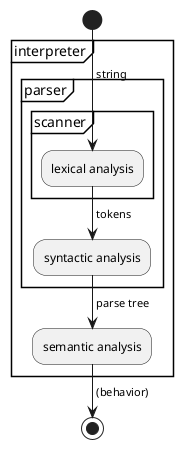
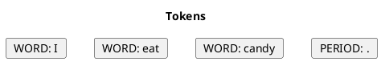
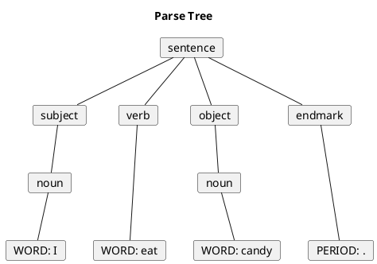
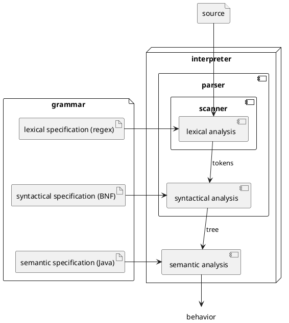

# Overview of Parsing and Syntax

Building a programming language ultimately comes down to building a
program that can run programs written in our new language. A program that
reads and evaluates a program is called an **interpreter**. Most
interpreters read and evaluate a program in roughly three sequential
process: lexical analysis, syntactic analysis, and semantic analysis.

> Any program that processes code written in a text-based
> programming language, must perform lexical analysis, syntactic analysis,
> and semantic analysis. Such programs include compilers, interpreters,
> and static analyzers such as linters. So the concepts in this section
> apply to all such tools.

> Seeing and error instead of a diagram?
>
> If you are seeing an error message for the diagram above, try reloading
> the page a couple times over a minute or so. If that still doesn't work,
> you could preview it inside your GitPod development environment (CTRL+SHIFT+V)
>
> Apply this same trick for the rest of the markdown reading.

In this section we will focus on the lexical and syntactic analysis processes,
which are collectively referred to as *parsing*. Parsing is informed by
a language's *syntax rules*, which describes the set of well-formed programs
that can be written in that language.

## Lexical Analysis and Tokens

**Lexical analysis** converts a sequence of characters into a sequence
of *tokens* (defined later). The component of a program that
performs lexical analysis is called a **lexer**, **tokenizer**, or a
**scanner** and is said to **lex**, **tokenize**, or **scan** its input.
If the lexer encounters a sequence of characters that it does not
recognize, it raises a **lexical error**.

**Tokens** are the smallest meaningful sequences of characters in a
language. They are the "words" of a language. Each token has a
name and a pattern. When a lexer matches a sequence of characters to
a token's pattern, the lexer emits the name of the token, and the
sequence of characters that it matched. The matched characters are
called a **lexeme**.

## Syntactic Analysis

**Syntactic analysis** converts a sequence of tokens into a
into a *parse tree*. If the syntactic analyzer cannot fit the sequence
of tokens into a valid parse tree for the language, then it raise a
**syntax error**.

## Parsing Example

Let's look at a small example. Let's parse the English sentence:

    I eat candy.

One reasonable lexer would split this text into WORD tokens and a PERIOD
token.

A reasonable syntactic analyzer might build the following parse tree from
these tokens.

Notice how the parse tree encodes information about the parts of speech,
sentence structure, and how the tokens relate to each other. This additional
information will be important for semantic analysis.

## Syntax

A language's **syntax** defines the structure of a well-formed programs
writing in that language. We define a language's syntax in two parts,
it's *lexical specification* and its *syntactic specification*.
These correspond to
the two subprocesses of our parser: lexical analysis and syntactic analysis.
Given these two specifications for a language,
PLCC can generate a complete parser for that language.

