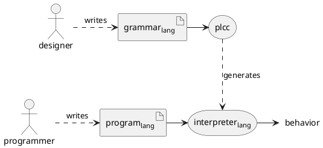
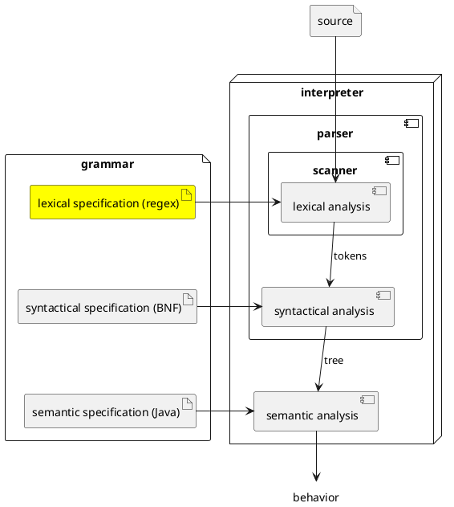

# Lexical Specification

The diagram below depicts where language designers, programmers, and PLCC fit in.
Language designers write
a grammar for the language they are designing. They use
PLCC to generate an interpreter for the language from
its grammar. Then programmers write programs in this language and
use the generated interpreter to run these programs.



In this course you will take on the role of a language designer.
The first thing you need to learn is how to define the syntax of
a language. Let's begin with the lexical specification.



A language's **lexical specification** defines the set of legal tokens
for that language. In PLCC, each token is given a name and a pattern.
The name is ALL_CAPS, and a pattern inside of quotes.
Here is an example of a lexical specification for the simplified
English example.

```
# Lexical specification for simplified English.
skip WHITESPACE '\s+'
token WORD '[a-zA-Z]+'
token PERIOD '\.'
```

Let's go over this line by line.

1. The first line is a comment. Comments begin with `#`.
2. The second line tells the lexer to recognize whitespace characters,
    but the `skip` says to not emit them as a token. Without this statement,
    the lexer would raise a lexical error when it encounters a whitespace.
    And since English words are separated by spaces, our lexer must recognize
    and skip them.
3. The third line defines the WORD token as a sequence of one or more
    alphabetic characters.
4. The fourth line defines the PERIOD token as the character `.`.

## Regular expressions

The patterns inside of quotes are regular expressions (regex).
Regular expressions are a well established language for
specifying patterns that match sequences of characters.
You do not need to know
the entire language, but you do need to know the following:

* Literal characters
* `\s`, `\S`, `\d`, `\D`, `\w`, and `\W`
* `.` and `\.`
* `[...]`, `[^...]`, `[a-z]`, `[A-Z]`, and `[0-9]`
* `*`, `+`, and `?`

The rest of this text assumes that you can read and write regular
expressions using the above constructs. A good way to learn them is to
complete interactive Lessons 1 - 9 from [RegexOne](https://regexone.com/). ***Do this now before continuing.***


## Important facts

Here are some important facts about PLCC's syntax for
lexical specifications.

* Token names must be UPPER_SNAKE_CASED.

* If the first character of a line is `#` then the entire line is a comment.

* You can omit the `token` reserved word when defining a token. For example,
    we could rewrite the simplified English lexical specification as

    ```
    skip WHITESPACE '\s+'
    WORD '[a-zA-Z]+'
    PERIOD '\.'
    ```

* You can enclose the regular expressions in double quotes instead of
    single quotes. This is useful if you need to match a single quote.

    ```
    token SINGLE_QUOTE "'"
    ```

## The Lexing Algorithm

The lexer generated by PLCC works as follows.

Until the input stream is empty, scan the stream from left-to-right

1. Identify all of the patterns that match the front (left side) of the input stream.
2. If no match exists, raise a lexical error and halt.
3. If multiple patterns match, take the longest match.
4. If there are multiple longest matches, takes the one whose rule appears
    first in the specification.
5. If the match is a token emit it. (Do not emit if it is a skip.)
6. Remove the match from the front (left side) of the input, and repeat starting from step (1).

Here is the same algorithm in a Python-like pseudo-code.

```python
def lex(input_stream, lexical_rules):
    while input_stream.has_more():
        matches = rules.match_front(input_stream)   # Step 1
        if matches.is_empty():                      # Step 2
            raise LexError(input_stream)
        matches = matches.longest()                 # Step 3
        match = matches.first_in_spec()             # Step 4
        if match.is_token():                        # Step 5
            emit(match.token())
        input_stream.remove_from_front(match)       # Step 6
```

Note: PLCC does not try to match patterns across new-line characters.
So a single token cannot span multiple lines.

## Longest match wins

Steps 3 and 4 are particularly important. They break ties when multiple
patterns match the front of the input stream.
Let's start with 3: `take the longest match`.
Consider the following specification:

```
WORD '[a-z]+'
ANY '.+'
HI 'hi'
```

And suppose our lexer is trying to match the front of this string.

```
hi there
```

All three patterns match. WORD and HI both match `hi`, but ANY matches
`hi there`. Since ANY is the longest match, it wins, and an ANY token is
emitted containing the lexeme `hi there`.

## First of longest matches win

Now consider rule 4. It applies when more than one pattern are equally
the longest match. In this case, the first pattern in the specification
wins. For example, consider the following specification.

```
WORD '\w+'
FROM 'from'
```

And suppose our lexer is considering the following string

```
from now on
```

In this case both WORD and FROM match `from`, and their matches are
equal in length. So they are both equally longest matches. To break
the tie, the lexer will choose the match from the rule that appears
first in the specification. So a WORD token is emitted containing
the lexeme `from`.

Notice that WORD will ***always win***, and FROM will never be emitted.
This is probably not our intention.
This is a common problem that can be avoided by placing patterns with
`+` and `*` quantifiers after patterns without these quantifiers.
If we rewrote our example specification as follows

```
FROM 'from'
WORD '\w+'
```

Now for the same string

```
from now on
```

FROM would be emitted, which is probably what we want.
