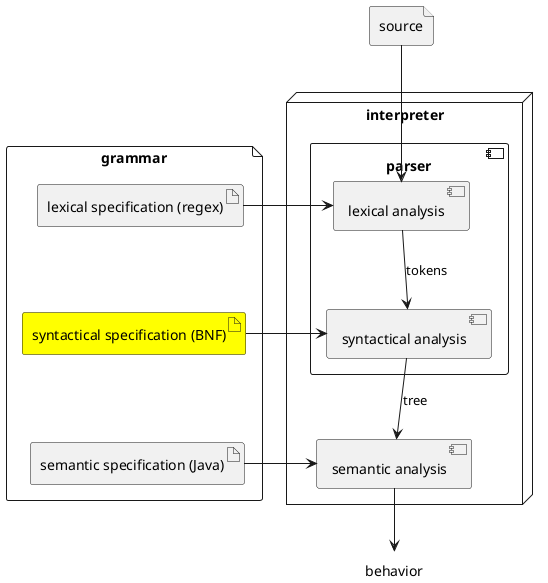

# Syntactic Specification in PLCC's BNF

Recall that a syntactic specification will be used by PLCC to generate
the semantic-analyzer; and the semantic-analyzer takes the token stream
generated by the lexer and produces a parse tree. Also recall that a
language's syntactic specification defines the structure of well-formed
programs written in that language.




## Basic Rules

Syntactic specifications are commonly written in BNF (Bakus-Naur Form).
This section describes PLCC's dialect of BNF (Bakus-Naur Form). A BNF
specification builds on top of the language's lexical specification by
referring to its tokens. One of the main purpose of BNF is to define the
legal ordering of TOKENs. For example, for our over-simplified English
example, we could write the following.

```
<sentence> ::= WORD WORD WORD PERIOD
```

This is a rule in BNF. All rules in BNF have the form `LHS ::= RHS`. The
LHS (left hand side) names a single non-terminal symbol. The RHS (right hand
side) defines the structure of that non-terminal symbol. The RHS may contain
tokens (AKA terminals) and non-terminals. The above rules reads,
"A `<sentence>` is three `WORDS` followed by a `PERIOD`."

We can define richer structures by including non-terminals on the RHS of
rules. For example, we might want to express the role that each WORD serves
in a `<sentence>`. One way to do this is to define new non-terminals and
refer to them in `<sentence>`'s definition.

```
<sentence> ::= <noun> <verb> <noun> PERIOD
<noun> ::= WORD
<verb> ::= WORD
```

We now see that a `<sentence>` is a `<noun>` followed by a `<verb>` followed
by a `<noun>` followed by a `PERIOD`, and that `<noun>` and `<verb>` are
both a `WORD`. This gives the reader (human or machine) more information
about the purpose of each `WORD` in a sentence. Notice, that this grammar
accepts the same set of "programs" as the previous one did.

## Alternate definitions

We can also provide alternate definitions for a particular non-terminal.
Suppose we want to allow sentences to end in either a PERIOD or a
QUESTION_MARK. First, we would add a new token definition to our lexical
specification (not shown here), and then we could update our BNF grammar
as follows.

```
<sentence> ::= <noun> <verb> <noun> <endMark>
<noun> ::= WORD
<verb> ::= WORD
<endMark> ::= PERIOD
<endMark> ::= QUESTION_MARK
```

Here we have added a new non-terminal `<endMark>`, but we have provide
two definitions for `<endMark>`. This tells the reader (human or machine)
that `<endMark>` can be either a PERIOD or a QUESTION_MARK.

## Zero or more and the empty string

So far, our `<sentence>` must have exactly 3 words. It might be nice
to allow longer or shorter sentences. We could start enumerating different
lengths of sentences defining `<oneWordSentence>`,  `<twoWordSentence>`,
etc. But what if we want to allow "any number of words"? We can do this
by using recursion and adding one new concept. Observe:

```
<sentence> ::= <words> PERIOD
<words> ::= WORD <words>
<words> ::=
```

The first rule states, "a `<sentence>` is `<words>` followed by a `PERIOD`".
Natural enough. The second rule says, "`<words>` is one `WORD` followed by
`<words>`". Notice this is a recursive definition. Each expansion of `<words>`
will provide (or match) another `WORD` and then must itself expand into more
`<words>`. To avoid infinite recursion, we need a base case, which is provided
by the last rule. This rule provides an alternative definition of `<words>`.
It states "`<words>` may be nothing". That is, we can satisfy `<words>` by
matching nothing at all, AKA the empty string.

## One or more

Notice that our new definition of `<sentence>` match a PERIOD all by itself!
That's probably not what we want. Let's rewrite it to match "one or more" WORDs.

```
<sentence> ::= WORD <words> PERIOD
<words> ::= WORD <words>
<words> ::=
```

Were you surprised? Were you expecting that we'd modify the definition of
`<words>`? We could express this a little differently.

```
<sentence> ::= <oneOrMoreWords> PERIOD
<oneOrMoreWords> ::= WORD <words>
<words> ::= WORD <words>
<words> ::=
```

The difference between the two is in their readability (by humans).
The author prefers the second, because it makes it explicitly that a sentence
is made up of one or more words.

## Separated by

Languages often need lists of things separated by (or delimited by) some
character. For example, maybe we want a list of words separated by a
comma. How would we express this in BNF?

```
<wordsByComma> ::= WORD <zeroOrMoreCommaWords>
<zeroOrMoreCommaWords> ::= COMMA WORD <zeroOrMoreCommaWords>
<zeroOrMoreCommaWords> ::=
```

Here `<wordsByComma>` has at least one `WORD` which is followed by
`<zeroOrMoreCommaWords>`. So WORD, followed by zero or more "COMMA WORD"s.

## Repitition operator (`**=`) and separated-by operator (`+`)

In fact, sequences are so common that PLCC's BNF provides some
**syntactic sugar** (simplified syntax for expressing the same thing)
for expressing sequences.

We can use `**=` instead of `::=` to define a non-terminal that represents
zero or more of its RHS. For example:

```
<sentence> ::= <zeroOrMoreWords> PERIOD
<zeroOrMorWords> **= WORD
```

Which means the same thing as

```
<sentence> ::= <zeroOrMoreWords> PERIOD
<zeroOrMoreWords> ::= WORD <zeroOrMoreWords>
<zeroOrMoreWords> ::=
```

PLCC's BNF does not have syntactic sugar for one-or-more.
Using `**=` and constructs that we have seen before, we can achieve
one-or-more as follows.

```
<sentence> ::= <oneOrMoreWords> PERIOD
<oneOrMoreWords> ::= WORD <zeroOrMoreWords>
<zeroOrMoreWords> **= WORD
```

However, PLCC does provide some syntactic sugar for separated-by. At
the end of the RHS of a repetition rule, we can add + followed by a token.
With this new notation, we can define a list of zero or more WORDs separated
by a COMMA as follows.

```
<wordsByComma> **= WORD +COMMA
```

Once again, remember `**=` means zero-or-more. So it may match the empty
string.
