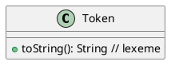
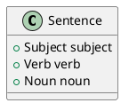
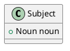
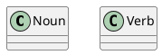
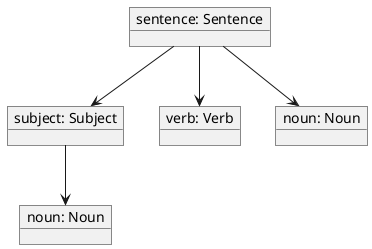
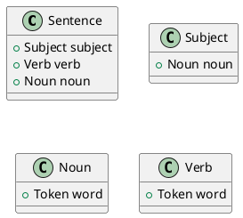
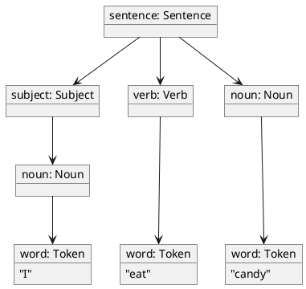
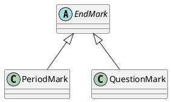

# Parsing

At this point we know how to read a lexical specification that uses
regular expressions as the pattern for tokens. We also know how to
read a syntactic specification written in PLCC's dialect of BNF. Now we
need to learn how to write a grammar that PLCC can generate a parser
for.

BNF is quite powerful. In fact, we can write specifications that PLCC can't
handle. There are two main reasons: 1) the nature of the code that PLCC
generates from a specification, and 2) because of the parsing algorithm
used by the parsers that PLCC generates. In this
section we will learn about the code that PLCC generates and
additional annotations that we can add to a grammar to help PLCC "do the
right thing". Then we'll learn about the parsing algorithm that PLCC uses
and what restrictions that places on the grammars we can write, and how
we can sometimes rewrite our grammars to overcome these limitations.

> Even with the additional annotations and rule rewrites discussed in
> this section, there still are languages that you can specify in BNF
> that PLCC cannot generate a parser for. This is true for nearly all
> parser generators that generate efficient parsers, not just PLCC.
> It all has to do with the parsing algorithm that the generator uses
> for parsing.
>
> For the theorists out
> there, PLCC generates LL(1) parsers. That is, they are a top-down
> recursive parser that scan tokens from left-to-right
> (the first L), following a leftmost derivation (the second L), and
> looks ahead 1 token to determine which rule to apply when multiple
> rules may apply (the 1).

## Classes

Given a grammar, PLCC generates Java classes to represent tokens and non-terminals. Specifically, PLCC generates a single `Token` class to
represent any token in the language, and it generates a class for the
LHS non-terminal of ***each*** BNF rule. For example, consider the following
grammar.

```
<sentence> ::= <subject> <verb> <noun> PERIOD
<subject> ::= <noun>
<verb> ::= WORD
<noun> ::= WORD
```

From this grammar, PLCC generates the following classes:

* `Token`
* `Sentence`
* `Subject`
* `Verb`
* `Noun`

Notice how PLCC title-cases each non-terminal's name to form a conventional
class name in Java.

The lexer emits a `Token` object for each token it matches. Each `Token`
contains the *lexeme* it matched (i.e., the matched string of characters)
which can be retrieved through its toString() method.



The BNF rules determine the structure of the other classes.
Instances of a class have a public attribute for each
non-terminal on the RHS of the rule that defines it. The name
and type of each attribute is determined by the name of the
non-terminal. For example, the structure of the `Sentence`
class is determined by the BNF rule that defines it; that's
the first rule because that's the rule that `<sentence>` is on
the LHS. So we're looking at this rule.

```
<sentence> ::= <subject> <verb> <noun> PERIOD
```

When PLCC generates `Sentence`, it creates public attributes for the
non-terminals in the RHS. `Sentence` now looks like this.



This same information can be conveyed concisely by the class's constructor's
signature (name+parameters).

```Java
Sentence(Subject subject, Verb verb, Noun noun)
```

We sometimes use constructor signatures (as in homework and on exams)
to identify the structure of a class that PLCC generates. So we'll
provide both in this document.

`Subject` is generated from the following rule

```
<subject> ::= <noun>
```

and has the following structure.



```Java
Subject(Noun noun)
```

The defining rules for `Verb` and `Noun` do not have
non-terminals in their RHS, so they do not have public
attributes.



```Java
Noun()
Verb()
```

These non-terminal classes are instantiated during
syntactic-analysis and are linked together to form a parse tree.

For example, if we parse the following sentence

```
I eat candy.
```

We would get the following parse tree.



## Capturing tokens

You may have noticed that the tokens are not represented in the
parse tree. That's because by default PLCC does not capture them into
the parse tree. We can ask PLCC to capture a token into the parse tree
by enclosing it in angle brackets in the grammar. Let's adjust are
example grammar to capture all of our tokens except `PERIOD`. Notice
that capturing `PERIOD` is not very useful in this grammar, because capturing it wouldn't add any new information to the tree.

```
<sentence> ::= <subject> <verb> <noun> PERIOD
<subject> ::= <noun>
<verb> ::= <WORD>
<noun> ::= <WORD>
```

Now when PLCC generates our classes, they now have an extra public attribute
for each token captured. The name of the attribute is the same as the
token name, but all lowercase. The type of a token is ***always*** `Token`
because there is only a single `Token` class used to represent any token.
Here's what our class diagram looks like now.


```java
Sentence(Subject subject, Verb verb, Noun noun)
Subject(Noun noun)
Noun(Token word)
Verb(Token word)
```

Now parsing the same sentence as before, we get the following parse tree.



## Alternative rules

If each BNF rule generates a class for the non-terminal on its LHS,
what happens when we have two or more BNF rules with the same
non-terminal on the LHS? This happens when we want to say that the
same non-terminal may have different alternative structures.

Consider this example in which we want to be able to end sentences
in a PERIOD or a QUESTION_MARK.

```
<sentence> ::= <subject> <verb> <noun> <endMark>
<subject> ::= <noun>
<noun> ::= <WORD>
<verb> ::= <WORD>
<endMark> ::= PERIOD
<endMark> ::= QUESTION_MARK
```

PLCC will try to generate the `EndMark` class twice, and raise and
error. To fix this, we need to provide a unique name for the class
we want PLCC to generate for each rule. These classes will be
subclasses of `EndMark`. This makes sense because each is a special
kind of `EndMark`.

```
<sentence> ::= <subject> <verb> <noun> <endMark>
<subject> ::= <noun>
<noun> ::= <WORD>
<verb> ::= <WORD>
<endMark>:PeriodMark ::= PERIOD
<endMark>:QuestionMark ::= QUESTION_MARK
```

So besides the other class, PLCC will generate



```java
EndMark()
PeriodMark()
QuestionMark()
```

## Duplicate terms in RHS

Sometimes we want to use the same non-terminal or token twice in the
RHS. For example, if we want to define a sentence as three WORDs followed
by a PERIOD. And let's assume we want to capture each WORD into the parse
tree.

```
<sentence> ::= <WORD> <WORD> <WORD> PERIOD
```

Then PLCC will try to generate a `Sentence` class with three attributes
with the same name: `word`.

```java
// ERROR: multiple attributes/parameters with the same name
Sentence(Token word, Token word, Token word)
```

That's a problem. So once again, we need to
give PLCC unique names for each duplicate term.


```
<sentence> ::= <WORD>:wordOne <WORD>:wordTwo <WORD>:wordThree PERIOD
```

Now PLCC will generate

```plantuml
class Sentence {
    + Token wordOne
    + Token wordTwo
    + Token wordThree
}
```

```java
Sentence(Token wordOne, Token wordTwo, Token wordThree)
```

> When naming attributes on the RHS, you can also leave out the colons,
> like so:
> ```
> <sentence> ::= <WORD>wordOne <WORD>wordTwo <WORD>wordThree PERIOD
> ```
> This is PLCC's traditional syntax for naming attributes.
> But to be consistent with the syntax for naming alternatives on the LHS,
> you can now use colons in the RHS too.
>
> The example languages leave out the colon on the RHS because they
> were written before the new syntax was available.
>
> I recommend being consistent and either don't use colons on either
> side, or use colons on both sides.


## Repeating rules generate parallel `List`s

Since the RHS of repeating rules `**=` can occur zero or more times,
the attributes for non-terminals and captured tokens on the RHS each
have a type of `List<X>` where `X` is the type of that non-terminal
or captured token. For example

```
<pairs> **= <NAME> <vector>v1 <vector>v2 +COMMA
```

This matches zero or more named pairs of vectors and separated by COMMA.
Assume a vector looks something like `<a:b:c>`. This pattern would match
something like the following.

```
forward <1:1:1> <-1:3:0>, backward <23:4:1> <2:2:2>
```

So the class generated for `Pairs` is

```plantuml
class Pairs {
    + List<Token> nameList
    + List<Vector> v1List
    + List<Vector> v2List
}
```

```java
Pairs(List<Token> nameList, List<Vector> v1List, List<Vector> v2List)
```

Take note of the type of token attributes, and the names of
the generated list attributes. Also notice that the
separator is not captured, nor can it be.

Also be aware that the structure of objects created by a
repeating rule is much different than when a list is
specified in BNF using recursion.

## Determining which alternative to take

When parsing and PLCC must choose between alternative rules to apply,
it must be able to determine which to apply by looking only at the
next token.

Consider the following grammar.

```
<english> ::= <sentence>
<sentence>:Question ::= WORD QUESTION_MARK
<sentence>:Statement ::= WORD PERIOD
```

Now when PLCC tries to parse the following sentence

```
Me?
WORD QUESTION_MARK
```

PLCC must determine which `<sentence>` rule to apply only by looking
at the next token, which is `WORD`. But both rules start with `WORD`.
So PLCC cannot determine which to use.

So when designing our language, we must make sure that the first token
in alternative rules are distinct from each other.

In the case of our example, PLCC can't know what type of sentence it
has until it reach the ending mark. So we push our alternative back
to that position.

```
<english> ::= <sentence>
<sentence> ::= WORD <endMark>
<endMark>:Question ::= QUESTION_MARK
<endMark>:Period ::= PERIOD
```

Now PLCC will have already match WORD in the RHS of `<sentence>`. So
when it needs to determine which `<endMark>` rule to apply, it has
QUESTION_MARK as the next token, so PLCC knows to use the `Question`
alternative.

## The Parsing Algorithm

The last section explained that the parser generated by PLCC need to
determine which alternative rule to apply by looking at the next token
in the input stream. This section tries to further clarify how this works
by manually implementing a parser for a given grammar. You do not need
to know how to implement such parsers by hand. This is here for illustration
and to help you understand at a deeper level what was stated in the previous
section.

The parser PLCC generates is a top-down, left-to-right, recursive-descent
parser that looks ahead 1 token: in other words it is an LL(1) parser.

What does that mean? To get an idea, let's build one by hand. Let's
build a parser for the following grammar.

```
<sentence> ::= <subject> <verb> <noun> <endMark>
<subject> ::= <noun>
<noun> ::= WORD
<verb> ::= WORD
<endMark>:PeriodMark ::= PERIOD
<endMark>:QuestionMark ::= QUESTION_MARK
```

We'll implement our parser in Python-like-pseudo-code. We'll assume there
is a global `scanner` object on which we can call `pop()` and `peek()`.
`pop()` returns the next token and removes it from the token stream.
`peek()` returns the next token without removing it from the token stream.
These methods will raise an exception if a lexical error is encountered,
or if we reach the end of file.

To construct a recursive descent parser, we create a parse function for each
rule in BNF. Each parse function returns an instance of the parse-tree node corresponding the non-terminal it defines. Here is the parse function for
the first BNF rule in our grammar.

```python
def parse_sentence():
    subject = parse_subject()
    verb = parse_verb()
    noun = parse_noun()
    endMark = parse_endMark()
    return Sentence(subject, verb, noun, endMark)
```

To parse/match its RHS, it calls the corresponding parser function for
each non-terminal in its RHS. Each of these functions return an object
containing the parsed subtree for that non-terminal. The last line of
the parse function builds and returns a `Sentence` object, passing it the
parts that make up this parse node. Notice this object represents a complete
parse-tree.

Here is the parse function for subject.

```python
def parse_subject():
    noun = parse_noun()
    return Subject(noun)
```

Here is the parse function for noun.

```python
def parse_noun():
    token = scanner.pop()
    if token.val != Token.NOUN:
        raise ParseError()
    return Noun(token)
```

Notice, we assume that `Token` has a `val` attribute that uniquely defines
each type of token in the language. And that these unique token values
are all defined in the `Token` class. `parse_noun` removes the next token
from the scanner, checks that it is in fact a noun, and returns it.

The parse function for verb is pretty much the same as that for noun.
endMark is where things get more interesting.

```python
def parse_endMark():
    look_ahead = scanner.peek()
    if look_ahead.val == PERIOD:
        endMark = parse_PeriodMark()
    elif look_ahead.val == QMARK:
        endMark = parse_QuestionMark()
    else:
        raise ParseError()
    return endMark
```

Because there are two alternative definitions for endMark, the parser
needs to distinguish between the two options based on the contents of
the token stream. The parsers PLCC generates are LL(1). That 1 indicates
that the parser looks ahead 1 token to make this determination. We can
see this in the parser function for endMark. The if statement in this
function is determining which parse function to call based on the next
token in the input stream. Also, if the function cannot determine which
parse function to call based on this token, it raises a parse error.

> When generating the parser, PLCC detects if the grammar you gave it is
> not parsable by its LL(1) parser. If the grammar is not in LL(1), then
> PLCC will report an error.
