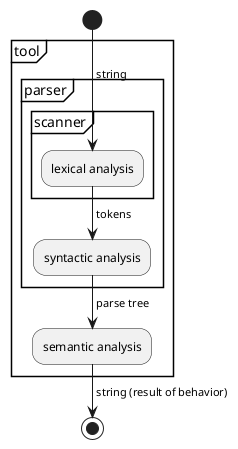
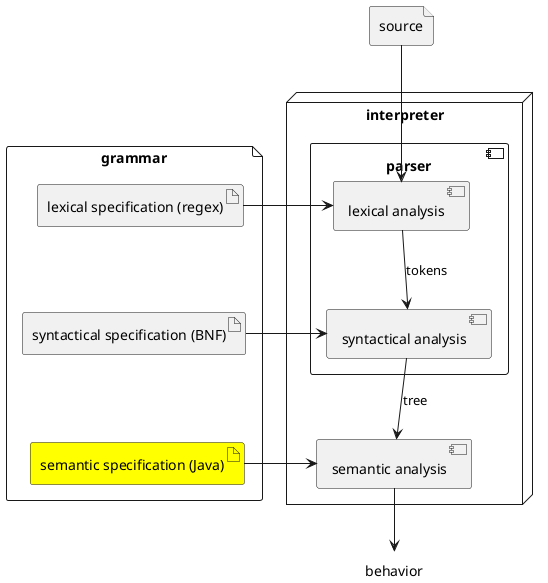
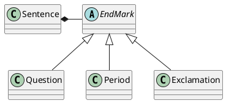

# Semantic Specification


Let's return to a more detailed diagram of the interpreter that we
are building. So far, we have learned how to write a lexical specification
using regular expressions from which PLCC generates a scanner that reads
a string and produces a sequence of tokens. We have also learned to write a
syntactic specification in BNF from which PLCC generates a parser that reads
tokens from the scanner and produces a parse tree.



Now we turn our attention to semantic analysis. The semantics of a program
written in a language, its meaning, is what it does when we run it. There
are different approaches to specify this: e.g., axiomatically, denoationally,
and operationally. In PLCC, we specify the semantics for a language
operationally. That means we write a program in a well-defined programming
language (Java) that exhibits the meaning of any program written in the
defined language (the new language we are designing). In short, we implement the tool for our new language in Java.




## Interpreters and the REP Loop

One tool we can write for our new language is an interpreter.

The basic operation of an interpreter is that it *reads* in a program,
*evaluates* it, and *prints* the result of that evaluation. And usually, an
interpreter performs these steps in a loop so that it can be used to
interpret multiple programs in sequence. This is known as a
read-evaluate-print loop: or the REP loop.

> **Fun Fact**
>
> There is a nice online interpreter tool called repl.it whose
> name is based on the REP loop.

When we run `plccmk`, along with the scanner (Scan.java) and parser
(Parse.java), it also generates the REP-loop (Rep.java).
Similar to the scanner and the parser, we can invoke the REP-loop from
the command-line using PLCC's `rep` command. The REP-loop and the `rep`
command are how we run the interpreter for the languages we invent in
PLCC.

In Pseudo-Java, the `rep` command does something like the following.

> **Note**
>
> You will not find this exact code in Rep.java or its related files.
> This is a simplification of what Rep does that provides a starting
> point for our discussion below.

```java
public class Rep {
    ...
    public void loop() {
        while (!scanner.isEOF()) {
            Object parseTree = parser.parse();
            String result = parseTree.toString();
            System.out.println(result);
        }
    }
}
```

The first line in the while-loop parses the input into a parse tree. The
object returned is the root of that parse tree.

The second line in the while-loop calls `toString()` on the root of the
parse tree. All of the work to evaluate the parse tree takes place
in this call. **This is where semantic analysis takes place.** The String
returned is the result of that evaluation.

The last line of the loop prints the result of the evaluation.

So, our job is to provide the implementation of `toString()` for the root
node in parse trees for our new language.

## Injecting code

PLCC allows us to write Java code in our grammar file. It injects this code
into the files it generates when we run `plccmk`. Let's build up
an example. Here is our overly simplified English sentence grammar.

```
skip WS '\s+'
token WORD '\w+'
token PERIOD '\.'
%
<sentence> ::= <subject> <verb> <noun> PERIOD
<subject> ::= <noun>
<noun> ::= <WORD>
<verb> ::= <WORD>
```

We'll use the following `test.sentence` file.

```
I eat candy.
```

Running this through `plccmk` and then running `rep` we get the
following result.

```bash
$ plccmk -c sentence.grammar
...
$ rep -n < test.sentence
Sentence@33909752
```

The `-n` flag is silencing an `-->` prompt just as with `parse`.

This confirms that `rep` calls `toString()` on the root of our
parse tree which is a `Sentence` object. In Java, all objects
have a default `toString()` method that returns a string that
contains its type and its memory address.

Let's provide a different implementation for Sentence's toString.

```
skip WS '\s+'
token WORD '\w+'
token PERIOD '\.'
%
<sentence> ::= <subject> <verb> <noun> PERIOD
<subject> ::= <noun>
<noun> ::= <WORD>
<verb> ::= <WORD>
%

Sentence
%%%
    public String toString() {
        return "Hi";
    }
%%%
```

Notice the single `%` after the syntactic specification.
This separates it from the semantic specification which comes
after. The structure that begins with `Sentence` tells PLCC that
we would like to inject the code inside the bracketing `%%%` into
the class `Sentence` that it generates from the BNF rules. Inside
those brackets we are providing a custom implementation of
`toString()`. Let's test our new specification.

```bash
$ rm -rf Java
$ plccmk -c sentence.grammar
...
$ rep -n < test.sentence
Hi
```

So now, the meaning of every "program" written in our sentence
language is "Hi". That's probably not what we want, but we now
know where the entrypoint is to our semantic analysis.

**The entrypoint to our semantic analysis is the toString() method
of the class corresponding to our grammar's start symbol.**

Let's expand our semantic specification, and have every node in
the tree call toString() on its children and concatenate them
together into a larger string and return this concatenated string.

```
skip WS '\s+'
token WORD '\w+'
token PERIOD '\.'
%
<sentence> ::= <subject> <verb> <noun> PERIOD
<subject> ::= <noun>
<noun> ::= <WORD>
<verb> ::= <WORD>
%

Sentence
%%%
    public String toString() {
        String s = subject.toString();
        String v = verb.toString();
        String n = noun.toString();
        return s+v+n;
    }
%%%

Subject
%%%
    public String toString() {
        String n = noun.toString();
        return n;
    }
%%%

Noun
%%%
    public String toString() {
        String w = word.toString();
        return w;
    }
%%%

Verb
%%%
    public String toString() {
        String w = word.toString();
        return w;
    }
%%%
```

Regenerating our interpreter based on this grammar and running it
on our test file, we get the following.

```bash
$ rep -n < test.sentence
Ieatcandy
```

This is much better. But notice that we have lost our period, and
the spaces between the words. That's because PERIOD is not captured
by our parser, and whitespace is matched but then skipped by our scanner.
But we can reintroduce them without capturing them (unless you want the
exact original whitespace). Let's modify `Sentence`'s `toString()` as
follows (the rest is the same).

```
Sentence
%%%
    public String toString() {
        String s = subject.toString();
        String v = verb.toString();
        String n = noun.toString();
        return s+" "+v+" "+n+".";
    }
%%%
```

Rebuild and rerun.

```bash
$ rep -n < test.sentence
I eat candy.
```

Wuhoo! We have reproduced our original input. This may not seam like a
lot, but notice that in doing so we have a semantic specification that
involves every node in any parse tree for our language. Currently,
the "meaning" of this language is to reproduce its input. Maybe we should
call it "parrot" semantics. Ooo, maybe "Poly" for short :)

## Injecting code into alternatives

Recall that PLCC generates an abstract base class as well as a class
for each alternative rule. For example, from the following grammar

```
<sentence> ::= <subject> <verb> <noun> <endMark>
...
<endMark>:Question ::= QUESTION_MARK
<endMark>:Period ::= PERIOD
<endMark>:Exclamation ::= EXCLAMATION_POINT
```

PLCC would generate the following classes (Subject, Verb, and Noun are
not shown).



With alternatives, we can inject code into the concrete classes as well
as the abstract base class. We'll need this capability to implement
polymorphic methods.

Suppose we to call `isQuestion()` on an `EndMark` from `Sentence`,
which should return `true` if the `EndMark` is a `Question` and `false`
otherwise.

```
Sentence
%%%
    public String toString() {
        return "" + endMark.isQuestion();
    }
%%%
```

Let's start with an ***BROKEN*** implementation to demonstrate the problem.
Suppose we define `isQuestion()` for each subclass of EndMark. Then we know
that every object that is an EndMark has a definition for this method.

```
Question
%%%
    public boolean isQuestion() {
        return true;
    }
%%%

Period
%%%
    public boolean isQuestion() {
        return false;
    }
%%%

Exclamation
%%%
    public boolean isQuestion() {
        return false;
    }
%%%
```

However, this does not work because in sentence, the type of the object
in endMark has a type of EndMark. And isQuestion() is not defined or
declared in EndMark. In other words, there is no guarantee that an
EndMark type has an `isQuestion()` method. To further illustrate the
point, you could later add a new endMark rule for ExclamatoryQuestion,
this would be a subclass of EndMark, but nothing requires you to implement
the `isQuestion()` method. Supposing you don't, then there is at least
one kind of EndMark that does not provide `isQuestion()`.

The fix is to at least declare an abstract `isQuestion()` method in EndMark,
which would declare to the world that all EndMarks have an `isQuestion()`
method. So adding the following to our above example fixes our implementation.

```
EndMark
%%%
    public abstract boolean isQuestion();
%%%
```

Alternatively, we could have provide a default implementation of `isQuestion()`
in `EndMark` and only override it's behavior those subclasses where it makes
sense to provide a different implementation. Let's do that by providing
a default implementation of the common case, when the EndMark is not a question.
Then we'll override it in Question to return true. This makes for a very
short, but complete definition of this polymorphic method. So small, we'll
even include our original Sentence definition.

```
Sentence
%%%
    public String toString() {
        return "" + endMark.isQuestion();
    }
%%%

EndMark
%%%
    public boolean isQuestion() {
        return false;
    }
%%%

Question
%%%
    public boolean isQuestion() {
        return true;
    }
%%%
```

## Repetition Rule `**=`

It's useful to know how to traverse a list that is produced by a
repetition rule. Recall that the repetition rule collects each term
on the RHS into a parallel array. Let's look at an example.

```
<pairs> **= <NUMBER>:a <NUMBER>:b +COMMA
```

This rule matches zero or more pairs of numbers separated by comma.
Here are some examples of strings it matches (it also matches the empty
string).

```
1 2
1 2, 3 4
1 2, 3 4, 5 6
```

PLCC generates the following class from the above rule.

```
Pairs(List<Token> aList, List<Token> bList)
```

Notice that a Pairs has two attributes, aList and bList, that are both
a list of tokens. These lists are parallel in that the element at index
0 in aList corresponds to the element at index 0 in bList.

To walk through this list, we might do something like the following.

```
Pairs
%%%
    public String toString() {
        ...
        for (int i = 0; i < aList.size(); i++) {
            Token a = aList.get(i);
            Token b = bList.get(i);
            // Do whatever you want with the pair a, b.
        }
        ...
    }
%%%
```

## Tip: Converting from String to int in Java

```java
String lexeme = token.toString();
int value = Integer.parseInt(lexeme);
```

## Tip: Converting from an int to a String in Java

```java
int value = 10;
String result = "" + value;
```

## Tip: Converting from a String to some other primitive

```java
String lexeme = token.toString();
double dval = Double.parseDouble(lexeme);
boolean bval = Boolean.parseBoolean(lexeme);
// etc.
```
