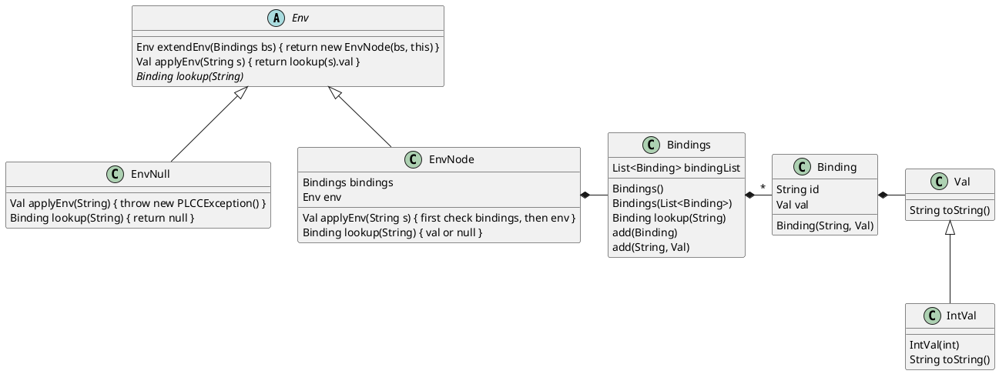

```plantuml
@startuml

abstract class Env {
    Env extendEnv(Bindings bs) { return new EnvNode(bs, this) }
    Val applyEnv(String s) { return lookup(s).val }
    {abstract} Binding lookup(String)
}

class EnvNode extends Env {
    Bindings bindings
    Env env
    Val applyEnv(String s) { first check bindings, then env }
    Binding lookup(String) { val or null }
}

class EnvNull extends Env {
    Val applyEnv(String) { throw new PLCCException() }
    Binding lookup(String) { return null }
}

class Bindings {
    List<Binding> bindingList
    Bindings()
    Bindings(List<Binding>)
    Binding lookup(String)
    add(Binding)
    add(String, Val)
}

class Binding {
    String id
    Val val
    Binding(String, Val)
}

class Val {
    String toString()
}

class IntVal extends Val {
    IntVal(int)
    String toString()
}

EnvNode *- Bindings
Bindings *- "*" Binding
Binding *- Val

EnvNull -[hidden] EnvNode

@enduml
```
