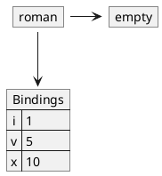
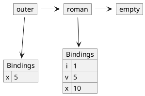
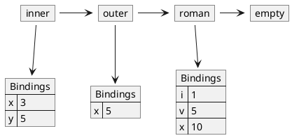
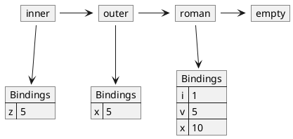
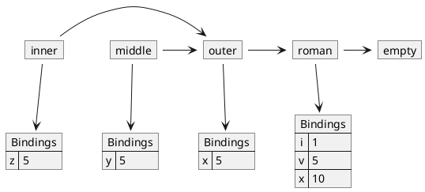

# LetExp

The syntax of a `LetExp` is as follows.

```
<exp>:LetExp ::= LET <letDecls> IN <exp>
<letDecls> ::= <VAR> EQ <exp>
```

A `LetExp` allows us to bind symbols to values and then evaluate
an expression within those bindings.

```
let
    x = 3
    y = 5
in
    +(x, y)
% is 8
```

In the above, `+(x, y)` is evaluated in an environment where x and y are
bound to 3 and 5; which results in 8. The result of a `LetExp` is the
result of evaluating its body expression. So in this case the result
of the entire `LetExp` is 8.

Now that we have a rough understanding of the meaning of a `LetExp`,
let's specify it more precisely in code.

```java
LetExp
%%%
    // <exp>:LetExp ::= LET <letDecls> IN <exp>
    public Val eval(Env env) {
        Env nenv = letDecls.addBindings(env);
        return exp.eval(nenv);
    }

    public String toString() {
        return "... LetExp ...";
    }
%%%
```

`LetExp` calls `letDecls.addBindings(env)`. This method does the following:

1. Evaluates the expressions on the RHS of the letDecls in the context of the
current enviornment.
2. Binds the resulting values to the symbols on the LHS.
3. Extends the current environement with the new bindings.
4. Returns the resulting new environment.

In code:

```java
LetDecls
%%%
    // <letDecls>   **= <VAR> EQUALS <exp>
    public Env addBindings(Env env) {
        Rands rands = new Rands(expList);                   // (1)
        List<Val> valList = rands.evalRands(env);           // (1)
        Bindings bindings = new Bindings(varList, valList); // (2)
        return env.extendEnv(bindings);                     // (3) and (4)
    }
%%%
```

## Evauating RHS expressions

RHS expressions are evaluate in the context of the SAME environemnt as the
owning `LetExp`.

```
let             % outer
    x = 5
in
    let         % inner
        x = 3
        y = x
    in
        y
% is 5!!!!
```

Let's evaluate the above graphically. Before we begin, in V3, we have the
following initial environment.



The outer let is evaluated in the context of this environment. The first
thing it does is evaluate the RHS expressions of its `LetDecls` in the context
of this SAME environment. The `LitExp` 5 evaluates to the `IntVal` 5. Then
these values are bound to the LHS symbols and the existing environment is
extended with a new environment containing these new bindings.



Now we evaluate the body, the inner `LetExp`, in the context of the environment
created by the outer `LetExp`. First, we evaluate ALL of its RHS expressions
in this SAME environment (the one created by outer).

`LitExp` 3 evaluates to `IntVal` 3. But what about `VarExp` x? We evaluate
it in the context of the environment created by outer. So when we look up
x in the current environment, we get back `IntVal` 5!!!

Now we bind these values with LHS symbols extending outer's environment
with these new bindings.



Finally, we evaluate the body of inner in this environment. The body is
the `VarExp` y; we look it up and get back the `IntVal` 5. This is the result
of the inner `LetExp` which is also the result of the outer.

> **TIPS for Evaluating LetDecls**
>
> * Evaluate ALL of the RHS expressions in the SAME environment that the
>   `LetExp` itself evaluates in (not its body).
> * Do not create the `Bindings` object until all of the RHS expressions
>   have been evaluated.
> * Do not extend the current environment until the `Bindings` object has
>   been created.

## `LetExp` inside a `LetDecl`

A `LetExp` is an `Exp` and can appear anywhere an `Exp` is expected in our
language. So how do we evaluate something like the following?

```
let                                 % outer
    x = 5
in
    let                             % middle
        y = let z = x in add1(z)    % inner
    in
        y
```

Let's start with our typcial setup for V3.


Now we begin evaluating the outer let. After evaluating its `LetDecl`
we have the following.


Now we begin evaluating the middle let. We start by evaluating
the RHS expressions in the same environment. So inner will be evaluated
in the same environment middle is evauated within; and that's the environment
created by outer.

So when we look up x in the inner, we get `IntVal` 5. Now that all of inner's
RHS expressions have been evaluated, we bind their values to their LHS symbols.



Now we evalute the body of inner within this environment.
We look up z and get 5, and add 1 to that, resulting in 6. This
is the result of the inner let.

Returning to the middle let, the result of the single RHS expression
is 6. Now we bind this to the LHS symbol y. **HERE IS THE TRICK**. Middle
is evaluating in the environment created by outer. So when it creates
its environemnt, it extends the outer's environment (not the inner's).



Now we evaluate middle's body within the environment it just created.
We look up y and find 5. This is the result of middle, and therefore outer.
