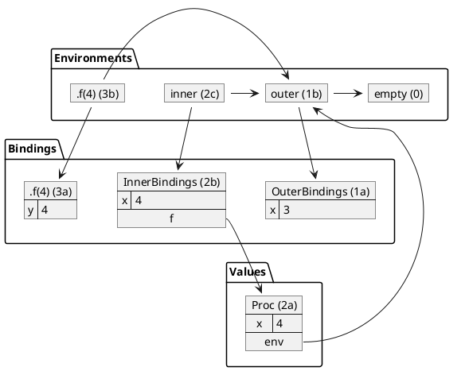
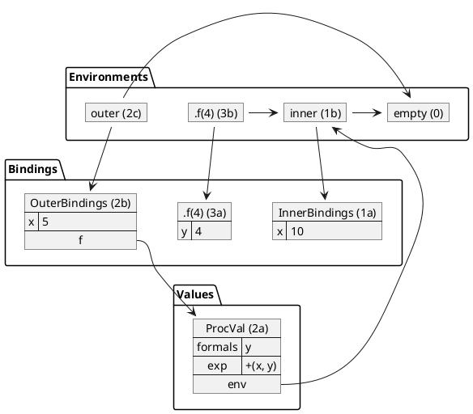

> **WARNING: DIAGRAMS ARE A WORK IN PROGRESS**
>
> I'm expirementing with drawing diagrams in plantuml.
> They may not be as good as the ones I draw in class.
> They may be missleading or even wrong, as I am currently
> more worried about convincing plantuml to do what I want.
>
> Stick with those in slides and lecture notes until further notice.

# Procs

A "proc" is short for procedure. It is what we would normally think of
as a "function" or a "subroutine". It is a reusable unit of computation.
It contains formal parameters, an expression (the computation), and an
environment (more on this later).

A proc must be defined before it can be called. We define a proc using
a `ProcExp`. When we evaluate a `ProcExp` we get a `ProcVal` which is the
defined proc. Then we can apply (call) the proc using an `AppExp`.

A `ProcExp` has the following syntax.

```
<exp>:ProcExp  ::= <proc>
<proc>         ::= PROC LPAREN <formals> RPAREN <exp>
<formals>      **= <VAR> +COMMA
```

Here are some examples:

```
proc () 3                     % When applied, evaluates to 3
proc (x) *(x, 2)              % Doubles the argument it is applied to.
proc (a, b, c) +(a, +(b, c))  % Sums its three arguments.
```

As all expressions do, each of the above `ProcExp` evaluates to a value.
They evaluate to a `ProcVal`. A `ProcVal` is a new kind of value. Each
`ProcVal` represents the defined proc and contains everything it needs
to be applied to some arguments. They have formal parameters (a list of
symbols), an expression (the body), and an environment (more on this later; honest).

You may have noticed that `ProcExp` do not provide a name for a proc.
A proc does not have a name; each is **anonymous**.
But, because `ProcExp` evaluate to a `ProcVal`, we can bind a `ProcVal` to a symbol/name.

```
let
    three = proc () 3
    double = proc (x) *(x, 2)
    sum_three = proc (a, b, c) +(a +(b, c))
in
    ...
```

To call/apply a proc, we use an `AppExp`.

```
<exp>:AppExp   ::= DOT <exp> LPAREN <rands> RPAREN
```

Here is an example.

```
let
    three = proc () 3
    double = proc (x) *(x, 2)
    sum_three = proc (a, b, c) +(a +(b, c))
in
    .sum_three(
        .three(),
        .double(5),
        7
    )
% 20
```

`DOT` (`.`) indicates that we want to apply a proc. After the `DOT`
is an expression that must evaluate to a `ProcVal`, the proc we want to
apply. In the above examples, each of these expressions are `VarExp` that
lookup the symbol in the current environment to get the `ProcVal`
bound to that symbol. Inside the parentheses are `Rands`, just as
with `PrimappExp`. These actual parameters (expressions) are evaluated
in the current environment to produce arguments (values). These values
are bound to the formal parameters (symbols) and the environment that
the `ProcVal` contains is extended with these bindings, forming a new
environment. The proc's body expression is evaluated in this new environment. The result of body expression is the result of the `AppExp`.

## First-class or higher-ordered procs

A language that allows functions to be passed into functions or returned
from functions is said to support **first-class functions** or
**higher-ordered functions**.

Our procs our higher-ordered functions.

Let's pass a proc to a proc.

```
let
    double = proc (x) *(2, x)
in
    let
        call_and_add_4 = proc(f, y) +(.f(y), 4))
    in
        .call_and_add_4(double, 2)
% 8
```

Here we pass double into call_and_add_4 as f. double applies f to its second
argument y, and then adds 4 to it. Notice that call_and_add_4 doesn't know
what function it's being passed. It just has to know how many and what type
of arguments to pass it.

> WHY? Ever write a sorting function for integers, then write another for
> strings, only to realize that they have almost the same code? Their only
> difference is how comparison is done. If the caller of your sort could
> pass you the correct comparison operation for the type they want to sort,
> then you could write a single sort algorithm that's parameterized with
> the sort. Heck this would let you sort ascending or descending without
> changing the sort code!

Let's return a proc from a proc.

```
let
    h = proc(f, g) proc(x) .f(.g(x))
    double = proc(x) *(x, 2)
in
    let
        quad = .h(double, double)
    in
        .quad(4)
% 16
```

This allows us to compose functions into more interesting functions!
Functional composition, here we come!

## Bound and free variables (symbols)

So far, all of the procs we have written only reference symbols
in their formal parameter list, which is often call its **local scope**.
These are all **bound variables/symbols**.

What happens if a proc tries to reference a symbol that is not in its
local scope? For example

```
proc(x) +(x, y)
```

Within the proc's local scope x is bound, but y is not. y is said to be
**free**. A language can either disallow free variables, or provide a
mechanism for resolving them when the proc is called.

We want to allow free variables in our procs, so let's figure out how
to resolve them.

## Static vs Dynamic Scoping

If procs can be passed around, then when they are applied, what environment
should they extend when creating their local environment? There are two
choices:

* The defining environment - the environment within which the proc was defined.
* The calling environment - the environment within which the proc is being applied.

Notice that if we choose to extend the defining environment, there is only
one such environment since each proc is defined only once. In fact,
the defining environment for a proc can be determined statically, without
running the program. This is called **static-scoping-semantics**.

Alternatively, if we choose to extend the calling environment, we can only
determine this environment at runtime. Why? Because a proc is a value and
can be passed into and out of procs and could be called from anywhere;
even in environments that have not yet been written. This is called
**dynamic-scoping-semantics**.

What's the difference?

```
let
    x = 3
in
    let
        f = proc () x
    in
        let
            x = 5
        in
            .f()
```

Is the result 3 or 5? If we implement dynamic-scoping and extend the calling
environment, then the above will evaluate to 5. If instead we implement
static-scoping and extend the defining environment, then the above will
evaluate to 3.

We will implement static-scoping for the same reason most popular,
modern languages do: the behavior of code written in such languages is
easier to predict thand code writing in a language with dynamic-scoping. 
That's because in dynamic-scoping introduces hidden dependencies
between the caller and the the proc. Changing the value of a variable
in the caller can unexpectedly change in the behavior of the call.
For example, if you call `foo()`, there is nothing that would indicate
that this call makes use of a value bound to your `x`. So if you change
what `x` is bound to, and then call `foo()` again, you would expect 
`foo` to behave exactly as it does before. But if `foo` makes use of your
`x`, surprisingly it may behave differently!

So how do we implement static-scoping?

We already have part of the mechanism to implement static-scoping:
the environment mechanism. To complete the implementation, when we
evaluate a `ProcExp`, we will capture the current environment with is
the **defining environment**. We will capture it by saving it with the
`ProcVal` that is created by the `ProcExp`; and we call this the
**captured environment**. Now when we apply a proc, we extend its
captured environment (which is the defining environment) with its
parameter bindings. Thus, any free variables in the proc will be
resolved in the defining environment.

> A higher-orderd function that captures its defining environment
is a **closure**.

## ProcExp and AppExp semantics

Now that we know we want our procs to use static-scoping to resolve
free variables, and we have a rough idea how to do it by capturing the
environment when the proc is defined, let's fully define the semantics
for `ProcExp` and `AppExp`.

```java
ProcExp
%%%
    public Val eval(Env env) {
        return proc.makeClosure(env);
    }
%%%

Proc
%%%
    // PROC LPAREN <formals> RPAREN <exp>
    public Val makeClosure(Env env) {
        return new ProcVal(formals, exp, env);
    }
%%%

ProcVal
%%%
...
public class ProcVal extends Val {
    public Formals formals;
    public Exp body;
    public Env env;

    public ProcVal(Formals formals, Exp body, Env env) {
        this.formals = formals;
        this.body = body;
        this.env = env;
    }
    ...
}
%%%
```

Working backwards, a `ProcVal` is a Java object that represents the
defined proc. It contains the formal parameters (a list of symbols),
a body expression that represents the reusable computation, and an
environment which is the captured defining environment.

A `ProcVal` is constructed when a `ProcExp` is evaluated. The containing
environment (the defining environment) is captured by passing it down
through a couple of calls until it gets to the `ProcVal` constructor.

So a `ProcExp` evaluates to a `ProcVal`.

Now what's the meaning of an `AppExp`?

```java
AppExp
%%%
    // DOT <exp> LPAREN <rands> RPAREN
    public Val eval(Env env) {
        Val v = exp.eval(env);                  // (1)
        List<Val> args = rands.evalRands(env);  // (2)
        return v.apply(args, env);
    }
%%%

ProcVal
%%%
...
public class ProcVal extends Val {
    public Formals formals;
    public Exp body;
    public Env env;
    ...
    public Val apply(List<Val> args, Env e) {
        if (formals.varList.size() != args.size())
            throw new PLCCException("formals/args number mismatch");
        Bindings bindings = new Bindings(formals.varList, args);        // (3)
        Env nenv = env.extendEnv(bindings);                             // (4)
        return body.eval(nenv);                                         // (5-6)
    }
    ...
}
%%%
```

To evaluate an `AppExp`...

1. Evaluate the `<exp>` after the `DOT` to get the `ProcVal`.
2. Evaluate the `Rands` to get arguments (values).
3. Bind the formal params of the `ProcVal` to the arguments.
4. Extend the CAPTURED ENVIRONMENT that is saved in the `ProcVal` with
    the new bindings.
5. Evaluate the `ProcVal`'s body expression within the new environment.
6. The result of the body expression is the result of the `AppExp`.

## Inlining ProcExp within an AppExp

We don't have to bind a `ProcVal` to a symbol before we apply it to some arguments. Recall that a `AppExp` has the following syntax:

```
<exp>:AppExp ::= DOT <exp> LPAREN <rands> RPAREN
```

Notice the expression after the DOT must evaluate to a `ProcVal`. And that `ProcVal` is what is applied to the passed arguments. In the examples above, we have always used `VarExp` in this position, which looks up a `ProcVal` in our current environment. However, this can be **any** expression, as long as it evaluates to a `ProcVal`.

Well, a `ProcExp` is an expression that evaluates to a `ProcVal`. Let's try defining the proc we want and immediately applying it!

```
.   proc(x) *(2,x)   (3)
```

Here we have an `AppExp` whose `<exp>` clause is a `ProcExp`. Recall, the `<exp>` is evaluated first to get the `ProcVal` to apply. So the `ProcExp` is evaluated giving us a `ProcVal`. Then we apply it to `(3)`. The entire expression evaluates to 6.

## Equivalence of AppExp + ProcExp and LetExp

Interestingly, an inlined `ProcExp` is functionally equivalent with a `LetExp`!

```
. proc(x) *(2, x) (3)
```

is the same as

```
let x = 3 in *(2, x)
```

Notice both extend the current environment with x bound to 3 and then evaluate the expression *(2, x), and result in the IntVal 6.

In fact, we can generalize this relationship as follows.

```
. proc(V1, V2, ..., Vn) B (E1, E2, ..., En)
```

Is functionally equivalent to...

```
let
    V1 = E1
    V2 = E2
    ...
    Vn = En
in
    B
```

This means that with `AppExp` and `ProcApp` we no longer need `LetExp`. But I hope the reader will agree that the let is much easier to read. So let's keep the `LetExp`!

However, we cannot eliminate `AppExp` and `ProcApp`. They give us something more than `LetExp`. ***They give us closures***. `LetExp` do not.

## Recursion

The language does not yet natively support recursion. Why?

```
let
    fact = proc(x)
            if zero?(x) then 1
            else *(x, . fact(-(x, 1))
in
    . fact (4)
```

The above does not work in V4. The problem is that the reference to `fact` in the body of the proc is *free*. Remember, at the time ProcExp is evaluated it captures the same environment that the `LetExp` is evaluated within. And that environment does not contain the binding of the `ProcVal` to the symbol `fact`.

So the language does not natively support recursion.

That's a huge loss. If we don't have recursion, how can we have repetition? Because if we don't have repetition, we don't have a Turing-Complete language. And if we don't have a Turing-Complete language, then we cannot solve any computable problem.

Do not despair. Because the language has higher-ordered functions, we can simulate recursion in this language. We do so by passing the `ProcVal` to itself as an argument when we call it.

```
let
    fact = proc(f, x)
            if zero?(x) then 1
            else *(x, . f(f, -(x, 1))
in
    .fact(fact, 4)
```

When we define the proc, we declare that it takes an extra parameter `f`. When applying the ProcVal, the caller will pass the same ProcVal as `f`. Inside the ProcVal, we assume `f` is the same ProcVal we are currently applying. This allows us to apply `f` and pass `f` to itself.

Now, as long as the initial caller passes the same ProcVal it wants to apply, we effectively have recursion. Of course, the caller could make a mistake and pass the wrong ProcVal. Let's fix that by defining a prepackaged ProcVal that knows how to call itself properly.


```
let
    fact = proc(x)
                let
                    f = proc(f, x)
                        if zero?(x) then 1
                        else *(x, . f(f, -(x, 1))
                in
                    .f(f,x)
in
    .fact(4)
```

We are saved. V4 has repetition!

## Examples


```
% outer
let
    x = 3
in
    % inner
    let
        x = 4
        f = proc(y) +(x, y)
    in
        .f(x)
% is 7
```



```
% outer
let
    x = 5

        % inner
    f = let
            x = 10
        in
            proc(y) +(x, y)
in
    .f(4)
% is 14
```





```
let
    g = proc(x)
            proc(y) +(x, y)
in
    let
        x = 4
        f = .g(3)
    in
        .f(4)
% is 7
```

```
let
    pow = proc(pow, x, y)  % x^y
            if zero?(y) then 1
            else *(x, .pow(pow, x, sub1(y))
in
    .pow(2, 3)
% is 8
```

## Exercise

Implement proc `one?(x)` that returns 1 if x is 1 and 0 otherwise.

Implement proc `lt?(x, y)` that returns 1 if x < y and 0 otherwise. Assume x and y are non-negative IntVals.
Hint: there are multiple algorithms to solve this. One is to repeatedly subtract 1 from each and determine which reaches 0 first. I didn't say it was efficient.

Implement Euclid's algorithm for GCD.
