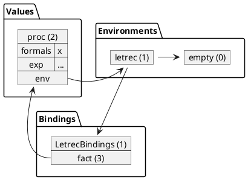

> **WARNING: DIAGRAMS ARE A WORK IN PROGRESS**
>
> I'm expirementing with drawing diagrams in plantuml.
> They may not be as good as the ones I draw in class.
> They may be missleading or even wrong, as I am currently
> more worried about convincing plantuml to do what I want.
>
> Stick with those in slides and lecture notes until further notice.


# LetrecExp

## Syntax

Tokens

```
LETREC 'letrec'
IN 'in'
```

BNF

```
<exp>:LetrecExp ::= LETREC <letDecls> IN <exp>
```

Syntactic examples

```
letrec
    fact = proc(x) {
        if zero?(x) then {
            1
        } else {
            *(x, .fact(sub1(x)))
        }
    }
in
    .fact(5)
```

## Semantics

```java
LetrecExp
%%%
    public Val eval(Env env) {
        env = letDecls.addLetrecBindings(env);
        return exp.eval(env);
    }
%%%

LetDecls
%%%
    public Env addLetrecBindings(Env env) {
        env = env.extendEnv(new Bindings(varList.size()));  // (1)
        Iterator<Token> varIter = varList.iterator();
        Iterator<Exp> expIter = expList.iterator();
        while (varIter.hasNext()) {
            String str = varIter.next().toString();
            Exp exp = expIter.next();
            // evaluate the operand expression in the letrec env.
            Val val = exp.eval(env);                        // (2.1)
            // and add the binding to the current env
            env.add(new Binding(str, val));                 // (2.2)
        }
        return env;
    }
%%%
```

1. Immediately extend the current environment with an empty Bindings.
2. In order
   1. Evaluate each RHS expression in this extended environment.
   2. Update Bindings in extended environment, binding each LHS symbol
        to the result of its corresponding RHS expression.
3. Evaluate the body in the extended environment.

## Recursion example

The example below demonstrates how letrec supports recursion.

```
letrec
    fact = proc(x) {
        if zero?(x) then {
            1
        } else {
            *(x, .fact(sub1(x)))
        }
    }
in
    .fact(5)
```

1. The empty environment is extended with an empty bindings; let's call this the letrec environment.
2. The `ProcExp` is evaluated in the letrec environment, so the `ProcVal` captures the letrec environment.
3. The bindings in the letrec environment is updated binding `fact` with the `ProcVal`.




Notice that the ProcVal captured the environment that binds `fact` to itself. So when `fact` runs, its local environment contains a reference to `fact`. So recursion works!

## Order matters

Because RHS expressions are evaluated in the same environment they update, the order RHS expressions matter.

```
letrec
    x = 3
    y = x
in
    y
% is 3
```

RHS expressions are evaluated in the order they appear, and each binding updates the Bindings object before the next expression evaluates. This means that later expressions can refer to previous bindings!

The downside to this is that letDecls in a LetrecExp cannot be evaluated in parallel. So ideally, they should only be used when you need to define a recursive proc.

## Mutual Recursion

Letrec's enable mutual recursion as well.

```
letrec
    even? = proc(x) if zero?(x) then 1 else .odd?(sub1(x))
    odd? = proc(x) if zero?(x) then 0 else .even?(sub1(x))
in
.even?(11)
% => 0 (false)
```
